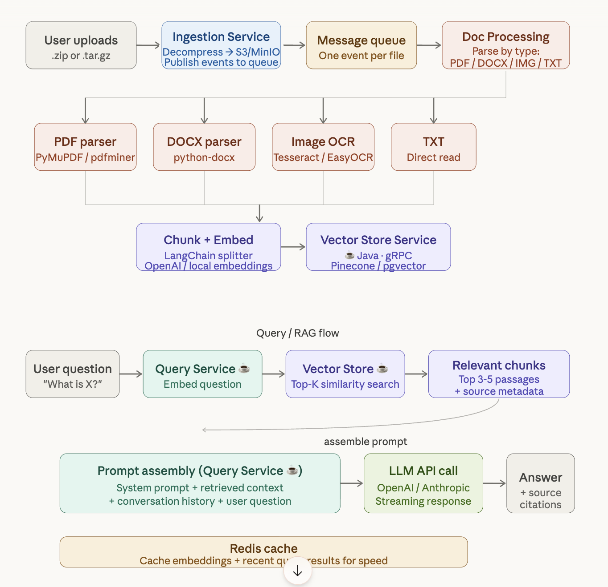

### Overview

 

### Tech stack breakdown
**Ingestion Service (Java / Spring Boot)**
This is the entry point. It accepts the zip/gz upload via a multipart REST endpoint, decompresses the archive in-memory or to temp storage, stores raw files in S3/MinIO with a UUID per job, then publishes one Kafka/RabbitMQ event per file. It never touches parsing — its only job is intake and fan-out.

**Document Processing Service (Python / FastAPI + Celery)**
This is the only Python service, and it earns its place here. PDFs go through PyMuPDF or pdfplumber (handles scanned PDFs too with embedded text), DOCX files go through python-docx, images go through Tesseract or EasyOCR for OCR, and plain text is read directly. Once text is extracted, LangChain's RecursiveCharacterTextSplitter breaks it into overlapping chunks (e.g. 512 tokens, 50 token overlap). Each chunk is then embedded using an embedding model (OpenAI text-embedding-3-small or a local model like bge-small-en). The resulting vectors + metadata are pushed to the Vector Store Service via gRPC.

**Vector Store Service (Java / Spring Boot)**
A thin Java wrapper around your vector database of choice. Pinecone is the easiest to start with, pgvector (Postgres extension) is best for self-hosted, and Weaviate is good if you want hybrid keyword + semantic search. This service handles both writes (from processing) and reads (from queries). Using gRPC here gives you fast, typed communication between services.

**Query / Chat Service (Java / Spring Boot)**
This is the RAG brain. When a question arrives, it: embeds the question (calling the same embedding model), does a top-K vector search against the Vector Store Service, retrieves the top 3–5 passages with source file metadata, assembles a prompt (system instructions + context chunks + conversation history + user question), and streams the LLM response back via WebSocket or SSE. Conversation history can live in Redis per session ID.

#### Key design decisions

Why Message Bus(Kafka, RabbitMq) over synchronous REST for ingestion? A 50-file zip should not make the user wait. Async processing means the upload returns immediately with a jobId, and the frontend polls or listens via WebSocket for completion events.

Chunking strategy matters a lot. Overlapping chunks (50–100 token overlap) prevent answers from being cut off at chunk boundaries. Metadata stored alongside each chunk (source filename, page number) lets you surface citations in the answer.

Embedding model consistency — the same model must be used at index time and at query time. If you switch models later, you need to re-embed everything.

File storage flow: Raw files → MinIO/S3 → processed text → PostgreSQL (metadata) + vector DB (embeddings). PostgreSQL stores job status, file metadata, and chunk records. The vector DB stores only the float vectors and chunk IDs.
Deployment: All four services run as Docker containers orchestrated by Kubernetes. The Python service scales independently — it's the most CPU-intensive, so you can give it more replicas without touching the Java services.
